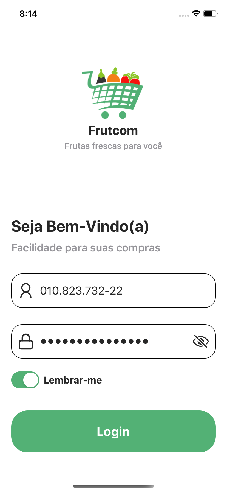
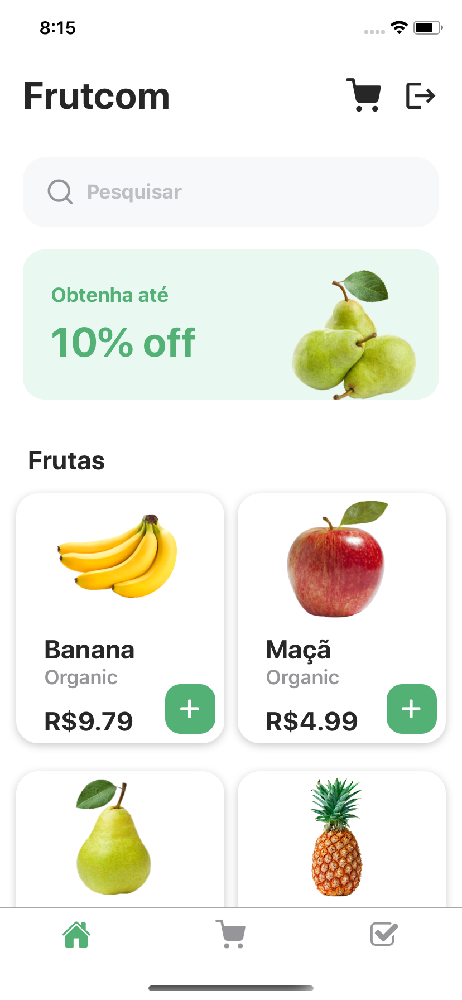
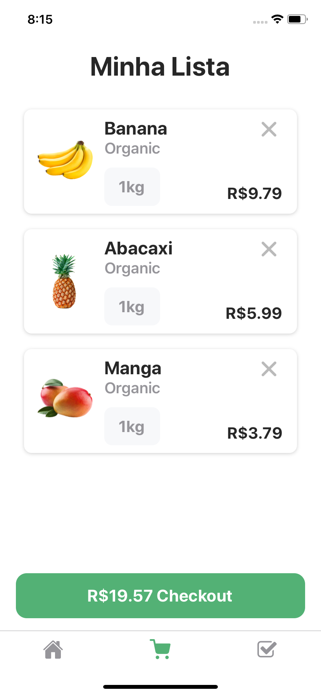

<h1 align="center">FRUTCOM</h1>

<br>

<div align="center" >
  
  
  
</div>

<br><br>

### 💻 Projeto Frutcom

Desenvolvimento de uma aplicação em React Native, com um intuito de um e-commerce para venda de cinco tipos de frutas: Maçã, Pera, Banana, Abacaxi e Manga. Após a autenticação, é possível comprar os itens disponíveis, excluí-los caso necessário e compartilhar o PDF do comprovante de compras.

<br>

Itens:
- [x] Autenticação na tela de Login
- [x] Pesquisa inteligente para filtro de frutas
- [x] Lista com as frutas disponíveis para compra
- [x] Lista com as frutas que foram ao carrinho de compras, ordenadas pela data 
- [x] Remoção de itens
- [x] Geração de compravante de compras para PDF
- [x] Compartilhamento do arquivo PDF gerado

<br>

### 🧪 Tecnologias
- ✅ React Native
- ✅ Expo
- ✅ Expo Print
- ✅ Expo Sharing
- ✅ Atomic Design
- ✅ React-Navigation (4x)
- ✅ Redux
- ✅ Redux Persist
- ✅ Redux Thunk
- ✅ UUID
- ✅ Flatlist
- ✅ StyleSheet
- ✅ Eslint

<br>

### 🚀 Realizando download e Instalando o Projeto

Para realizar o clone e instalação do projeto, siga as etapas abaixo:

Clone o projeto e entre no diretório criado:

```
git clone https://github.com/luisgustavofin/Frutcom
cd Frutcom
```

Instale as dependências:
```
yarn install
```

Inicie a aplicação no emulador:
```
expo start
```